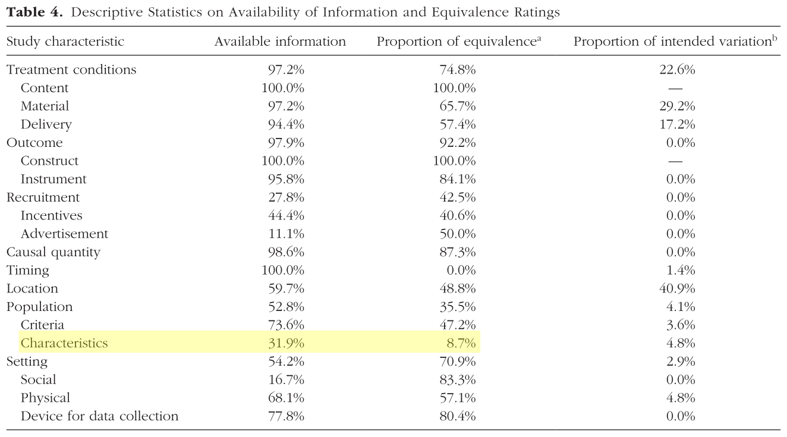
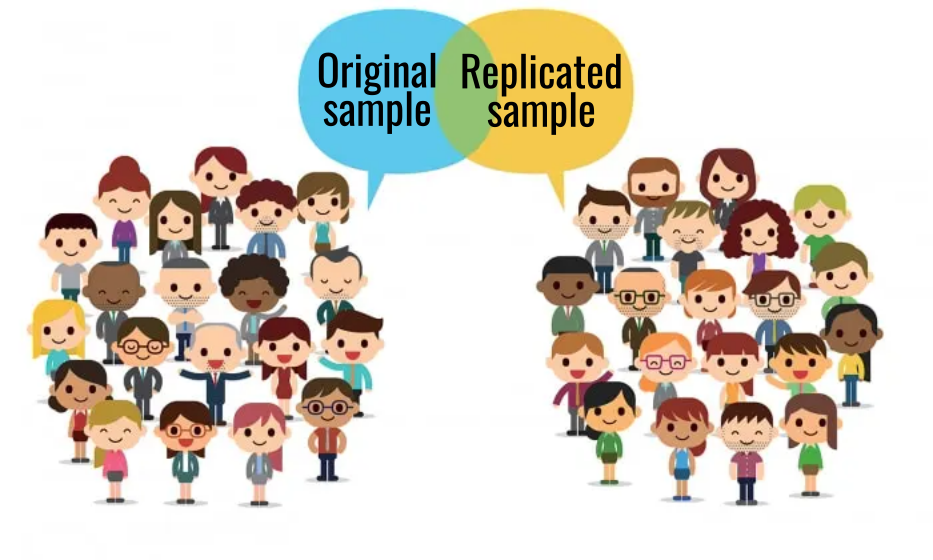
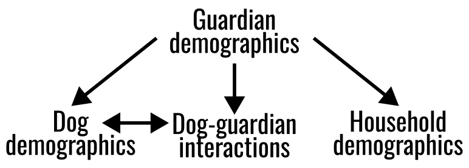
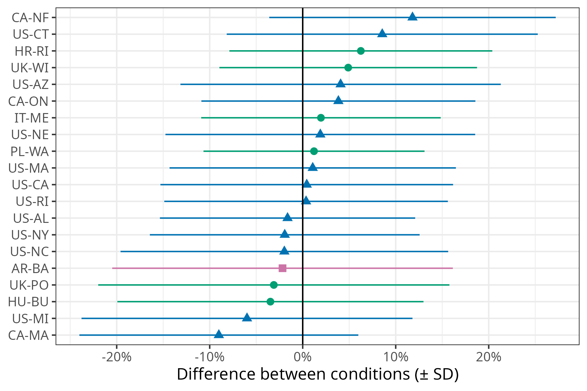

# Introduction

<!-- ## Failed replications -->

<!--  -->

<!-- :::{.source} -->
<!-- Photo by <a href="https://unsplash.com/@silverkblack?utm_source=unsplash&utm_medium=referral&utm_content=creditCopyText">Vitaly Gariev</a> on <a href="https://unsplash.com/photos/students-looking-at-phones-in-a-lecture-hall-QCNJ3xGnFR4?utm_source=unsplash&utm_medium=referral&utm_content=creditCopyText">Unsplash</a> -->
<!-- ::: -->

## Failed replication

{fig-align="center" height="550" fig-alt="Brown dog facing two plates: a yellow one with 1 treat and a white one with 3 treats."}

:::{.source}
[Stevens et al. 2022. _Animal Behavior & Cognition_.](https://doi.org/10.26451/abc.09.03.02.2022)
:::

## Why do replications fail?

* Publication bias
* Methodological/setting differences
* Measurement error
* Statistical inference issues
* Timing/zeitgeist

:::{.fragment}
* Sample characteristics 
:::

:::{.source}
[Hoffmann et al. 2025. _Advances in Methods and Practices in Psychological Science_.](https://doi.org/10.1177/25152459251328273)
:::

<!-- ## Population characteristics -->

<!-- {fig-align="center" height=550} -->

<!-- :::{.source} -->
<!-- [Hoffmann et al. 2025. _Advances in Methods and Practices in Psychological Science_.](https://doi.org/10.1177/25152459251328273) -->
<!-- ::: -->

<!-- * Hoffmann et al. 2025 found only 8.7% equivalence in population characteristics between replications and original studies -->

<!-- * By far, lowest equivalence rate of 15 factors, except timing which was 0% -->

<!-- * Fewer than 10% of studies were equivalent in terms of age and gender of the sample -->

<!-- ## Variation in study populations -->

<!-- * Population source -->
<!-- * Recruitment strategies -->
<!-- * Time of year/semester -->

## Comparing samples

{fig-align="center" height=550 fig-alt="Illustration of two groups of people, one labeled 'Original sample' and one labeled 'Replicated sample'."}

:::{.source}
Source: [Medium](https://medium.com/the-modern-scientist/comparing-two-populations-in-data-science-9a9379086892)
:::

<!-- * Historically, most replications were one lab replicating another lab -->

<!-- * This requires reporting consistent demographics: Hughes, Camden, & Yangchen, 2016; Singh et al., 2024, 2025; Sterling, Pearl, Liu, Allen, & Fleischer, 2022 -->

## Big team science to the rescue

{fig-align="center" width="1000" fig-alt="Map of the world with a network of sites/nodes connected by lines."}

<!-- * BTS expands replication efforts to allow large-scale comparisons across sites -->

<!-- * Includes consistent demographics -->


# ManyDogs Project

## ManyDogs Project

International research consortium of scientists with shared interest in canine behavior and cognition ([manydogs.org](https://manydogsproject.github.io))

{fig-align="center" height="300" fig-alt="ManyDogs logo with yellow, orange, and blue dogs jumping between the words Many and Dogs."}


## ManyDogs Project

{fig-align="center" fig-alt="Map of the world with ManyDogs Project sites marked with blue dots."}

## ManyDogs 1

::: {.callout-tip appearance="simple"}
## Research Question

::: {style="font-size: 40px"}
Do dogs treat human pointing as communicative cues?
:::
:::

{.absolute top=250 left="55%" width="550" fig-alt="Image of woman pointing to one of two blue cups, with a black dog looking on."}

::: {.fragment}
* 704 dogs tested
* 20 research sites
<!-- * 455 dogs with complete data -->

{.absolute top=250 left="55%" width="600" fig-alt="Map of the world with ManyDogs 1 research sites marked with blue dots."}
:::

::: {.source}
[ManyDogs Project et al. 2023, _Animal Behavior & Cognition_.](https://doi.org/10.26451/abc.10.03.03.2023)
:::

## ManyDogs 1 demographics

:::{.fragment}
### Dog demographics
* Age, sex, neuter status, breed, origin, years in home
:::

:::{.fragment}
### Guardian demographics
* Age, gender
:::

:::{.fragment}
### Household demographics
* Dogs in household, urban/suburban/rural environment
:::

## Demographics levels

{fig-align="center"}


:::{.source}
[Espinosa et al. 2026. _Current Directions in Psychological Science_.](https://doi.org/10.1177/09637214261450055)
:::


## Continuous demographics across sites

{fig-align="center" height="600" fig-alt="Ridgeline plot of distributions of four variables (dog age, dog years in home, guardian age, dogs in household) for each of 20 research sites." .fragment}


## Binary demographics across sites

{fig-align="center" height="600" fig-alt="Dot plot of percentages of six variables (dog percent female, dog percent neutered, dog percent purebred, dog percent from breeding, percent urban/suburban, guardian percent female) for each of 20 research sites." .fragment}


## Regional comparisons

{fig-align="center" height="600" fig-alt="Dot plot and mean +/- 95% confidence interval of percentages of six variables (dog percent female, dog percent neutered, dog percent purebred, dog percent from breeding, percent urban/suburban, guardian percent female) separated by region (Europe vs. North America)." .fragment}


<!-- ## Behavioral data across sites -->

<!-- {fig-align="center" height="600" .fragment} -->


<!-- ## Demographic effects on behavior -->

<!-- {fig-align="center" height="600" .fragment} -->


## Summary

::: {.incremental}
* Multiple levels of variation

* Striking demographic variation across research sites

* But how do we do this outside of big team science?
:::


# Consistent demographics

## Reported demographics

{fig-align="center" height="600" fig-alt="Cleveland dot plot showing the percent of survey respondents recording demographic information for the top 20 most recorded demographics. Values range from 98% to 53%."}

## Recommended demographics

{fig-align="center" height="600" fig-alt="Cleveland dot plot showing the percent of survey respondents recommending demographic information for the top 20 most recommended demographics. Values range from 96% to 39%."}

# Wrap-up

## Take home message

Carefully consider and fully describe your sample

{fig-align="center" height=500 fig-alt="Image of room of people with their dogs."}

:::{.source}
Source: [The Hollywood Reporter](https://www.hollywoodreporter.com/video/inside-hollywoods-pet-friendly-offices-722375/)
:::

## Thank you

```{r}
library(icons)
```

 `manydogs.org`

 `manydogsproject`

 `@manydogs.bsky.social`

 `fediscience.org/@ManyDogs`

 `linkedin.com/company/manydogs`

 `manydogsproject`


{.absolute top="10%" left="70%" height="550" fig-alt="Image of light brown dog with yellow tennis ball in its mouth."}

:::{.source}
Photo by <a href="https://unsplash.com/@ethanrichardson?utm_source=unsplash&utm_medium=referral&utm_content=creditCopyText">Ethan Richardson</a> on <a href="https://unsplash.com/photos/white-and-brown-long-coated-dog-playing-tennis-ball-sZqAaxhXNtU">Unsplash</a>
:::

<!-- * Website (https://manydogs.org/) -->
<!-- * Bluesky (https://bsky.app/profile/manydogsproject.bsky.social) -->
<!-- * Mastodon (https://fediscience.org/@ManyDogs) -->
<!-- * GitHub (https://github.com/manydogsproject) -->
