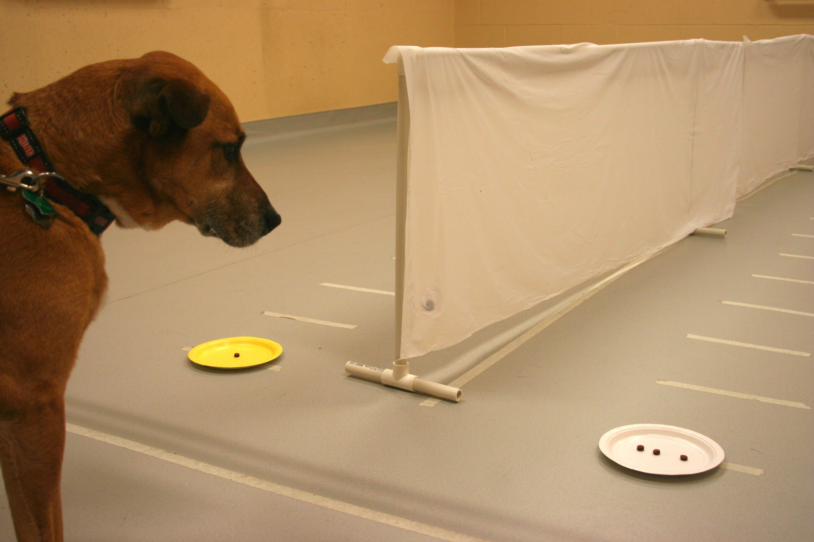
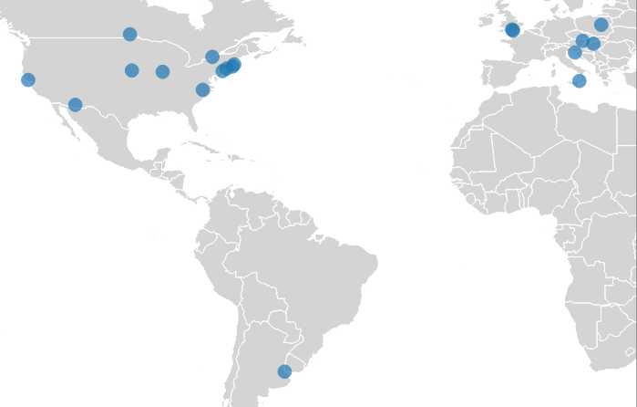
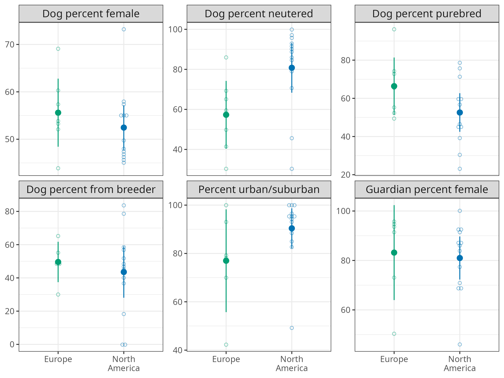
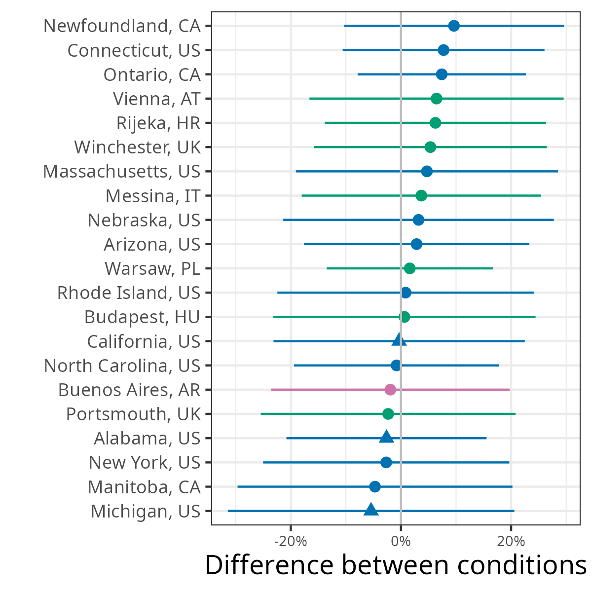
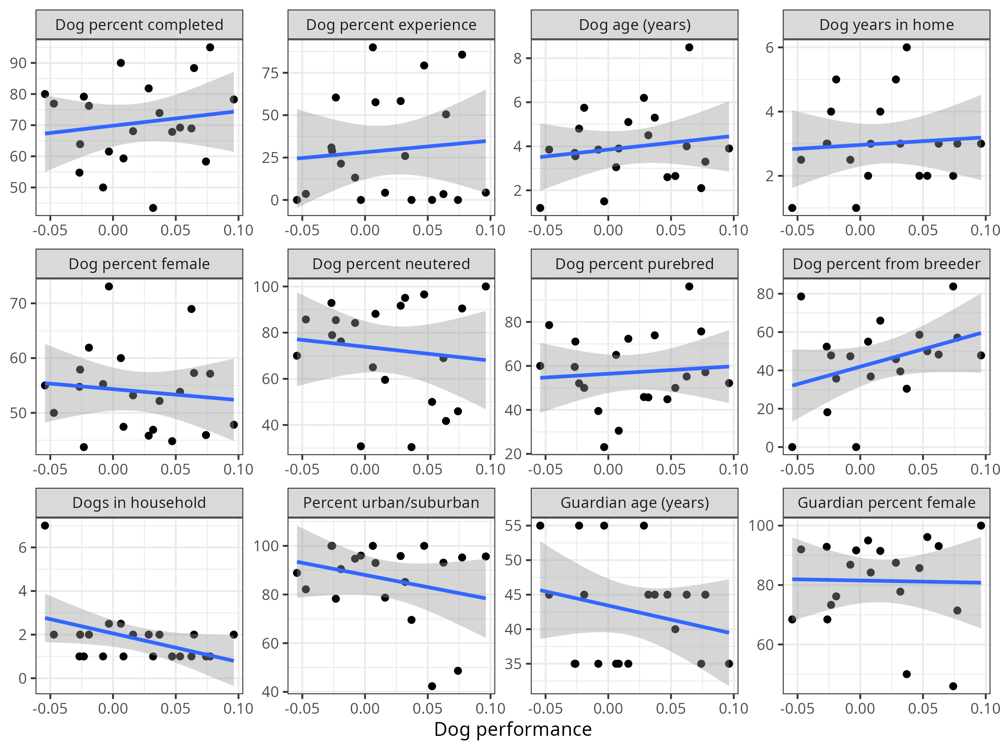
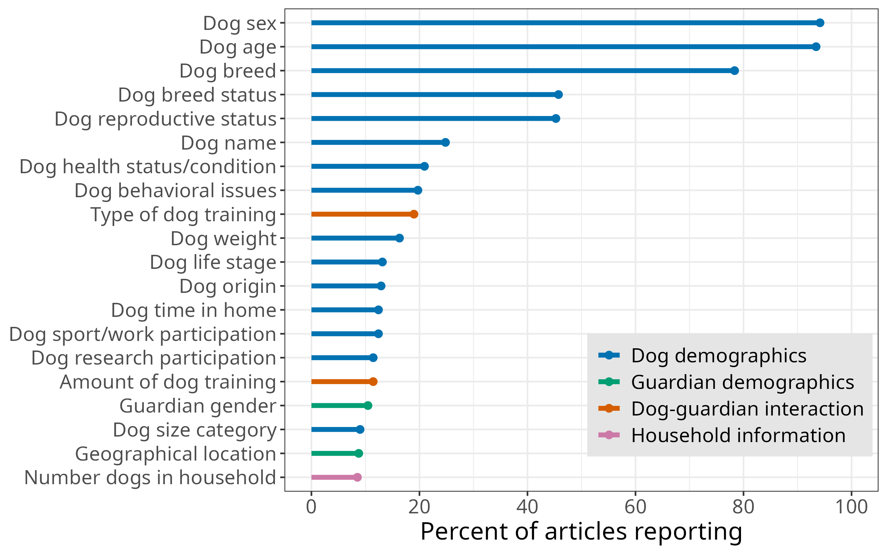

# Introduction

## Failed replications

:::{.source}
Photo by <a href="https://unsplash.com/@silverkblack?utm_source=unsplash&utm_medium=referral&utm_content=creditCopyText">Vitaly Gariev</a> on <a href="https://unsplash.com/photos/students-looking-at-phones-in-a-lecture-hall-QCNJ3xGnFR4?utm_source=unsplash&utm_medium=referral&utm_content=creditCopyText">Unsplash</a>
:::

## Personal example

{fig-align="center"}

:::{.source}
[Stevens et al. 2022](https://doi.org/10.26451/abc.09.03.02.2022)
:::

## Why do replications fail?

* Publication bias
* Methodological differences
* Setting differences
* Measurement error
* Statistical inference
* Timing/zeitgeist

:::{.source}
Hoffmann et al. 2025
:::

## Populations

* Hoffmann et al. 2025 found only 8.7% equivalence in population characteristics between replications and original studies

* By far, lowest equivalence rate of 15 factors, except timing which was 0%

* Fewer than 10% of studies were equivalent in terms of age and gender of the sample

## Variation in study populations

* Population source
* Recruitment strategies
* Time of year/semester

## Comparing populations

* Historically, most replications were one lab replicating another lab

* This requires reporting consistent demographics: Hughes, Camden, & Yangchen, 2016; Singh et al., 2024, 2025; Sterling, Pearl, Liu, Allen, & Fleischer, 2022

## Big team science to the rescue

* BTS expands replication efforts to allow large-scale comparisons across sites

* Includes consistent demographics

# ManyDogs Project

## ManyDogs Project

International research consortium of scientists with shared interest in canine behavior and cognition ([manydogs.org](https://manydogsproject.github.io))

{fig-align="center" height="300" fig-alt="ManyDogs logo with yellow, orange, and blue dogs jumping between the words Many and Dogs."}

## ManyDogs Project

{fig-align="center" fig-alt="Map of the world with ManyDogs Project sites marked with blue dots."}

## ManyDogs 1

::: {.callout-tip appearance="simple"}
## Research Question

::: {style="font-size: 40px"}
Do dogs treat human pointing as communicative cues?
:::
:::

{.absolute top=250 left="55%" width="550"}

::: {.fragment}
* 20 research sites
* 704 dogs tested
* 455 dogs with complete data

{.absolute top=250 left="55%" width="600" }
:::

::: {.source}
[ManyDogs Project et al. 2023, _Animal Behavior & Cognition_](https://doi.org/10.26451/abc.10.03.03.2023)
:::

## ManyDogs 1 demographics

### Dog demographics
* Age, sex, neuter status, breed, origin, years in home, previous research experience

### Guardian demographics
* Age, gender

### Household demographics
* Dogs in household, urban/suburban/rural environment

## Continuous demographics across sites

{fig-align="center" height="600" .fragment}

## Binary demographics across sites

{fig-align="center" height="600" .fragment}

## Regional comparisons

{fig-align="center" height="600" .fragment}

## Behavioral data across sites

{fig-align="center" height="600" .fragment}

## Demographic effects on behavior

{fig-align="center" height="600" .fragment}

## Summary

{fig-align="center"}

# Consistent demographics

## Reported demographics

{fig-align="center" height="600"}

## Recommended demographics

{fig-align="center" height="600"}

# Wrap-up

## Take home message

::: {.incremental}
* Multiple levels of variation

* Striking demographic variation across research sites

* Inconsistent reporting of demographics

* Carefully consider sample when comparing studies
:::

## Thank you

* Website (https://manydogs.org/)
* Bluesky (https://bsky.app/profile/manydogsproject.bsky.social)
* Mastodon (https://fediscience.org/@ManyDogs)
* GitHub (https://github.com/manydogsproject)
